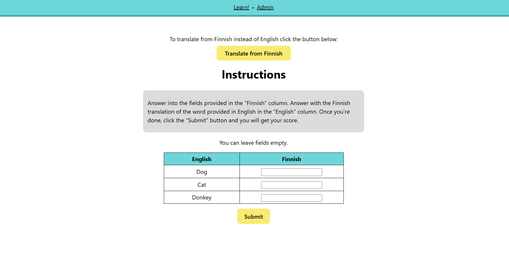
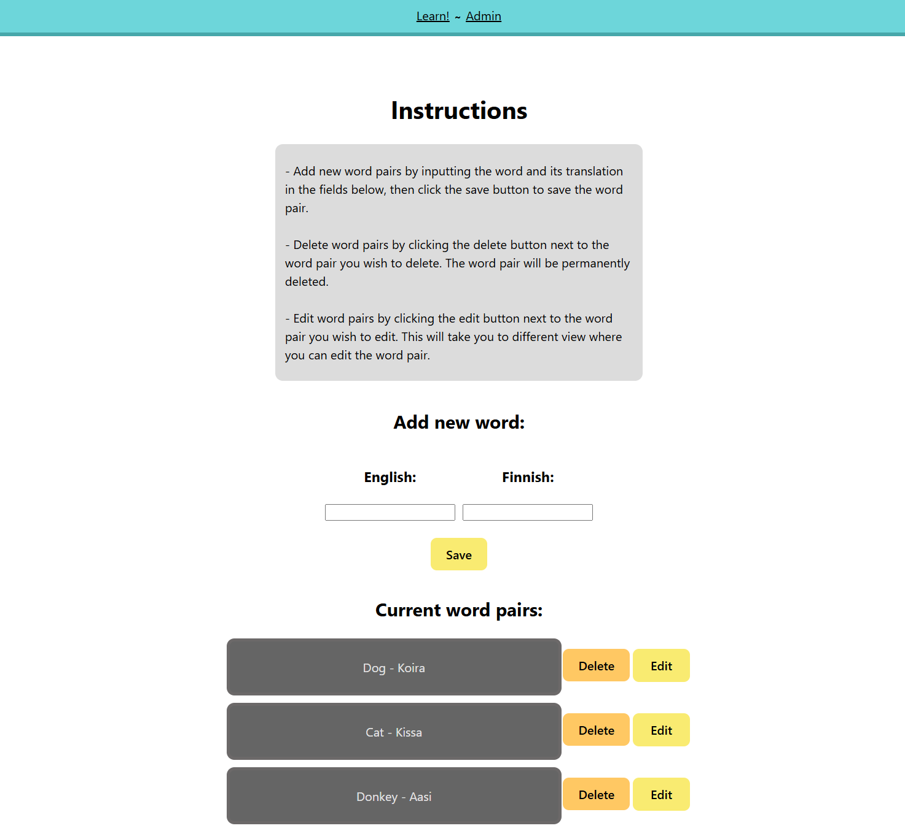
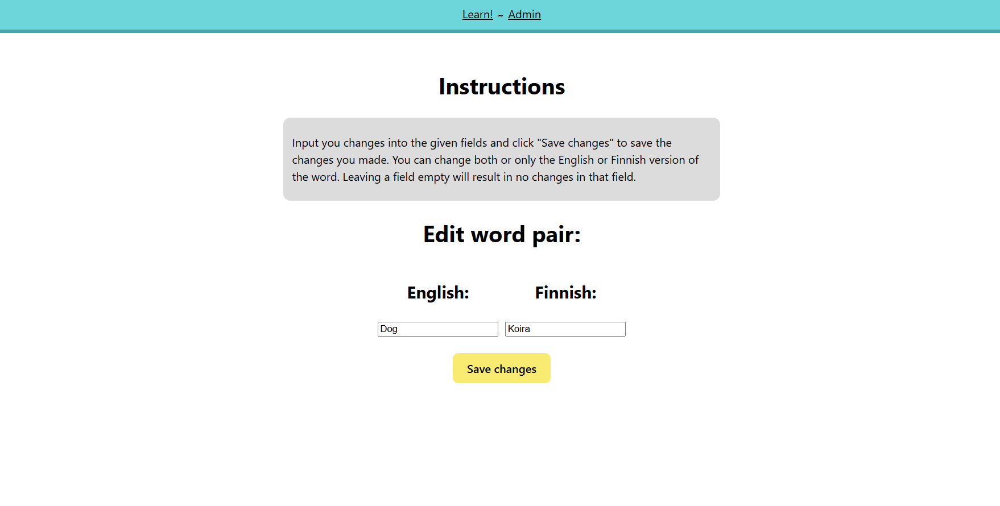

# project-work-fullstack
## Learn English App

# General
This is a small scale fullstack app meant for learning english words by translating them into finnish.

## Features
### User
Users are able to train with the given words by inputting them into answer fields. Users can then submit their answers and get their score.
Users can switch which language they wish to translate from.

### Admin
Admin is able to add, delete or edit word pairs in the app. The word pairs are stored in a database.

# Usage
## User
Translate the given words into the empty fields next to them and once you're done click the submit button to get your score.

You can change wheter yiu want to translate the words into English or Finnish by clicking the provided button.

## Admin
- Add new word pairs by inputting the word and its translation into the given fields. Press the save button to save the word pair.
- Delete the word pair by clicking the adjacent delete button. This will permanently remove the word pair.
- Edit a word pair by clicking the adjacent edit button. This will open a new view where you will be able to edit the word pair. Make changes into the word pair by inputting them in the given fields and then clicking the save changes button. Both fields do not need to be filled to make changes.

# How to run this project
In the cloned repository run the following commands:

1. npm run install-all
2. npm run start

Project should now be ready to use.

# Endpoints

- `GET /api/words` Fetches all word pairs.
- `POST /api/words` Adds a new word pair.
- `DELETE /api/words/:wordId` Deletes a specific word pair.
- `GET /api/words/:wordId` Fetches a specific word pair.
- `PATCH /api/words/:wordId` Updates a specific word pair.

# Link to a working project in cloud
Click this link [Learn English App](https://backend-dev-deployment.onrender.com) to open a working version of the project in cloud.
# Screenshots
## User View

**Initial view when the app is opened**

**An alternative language learning view**

## Admin View

**Admin view to add, delete and access editing word pairs**

**Edit view to edit word pairs**

# Screencast